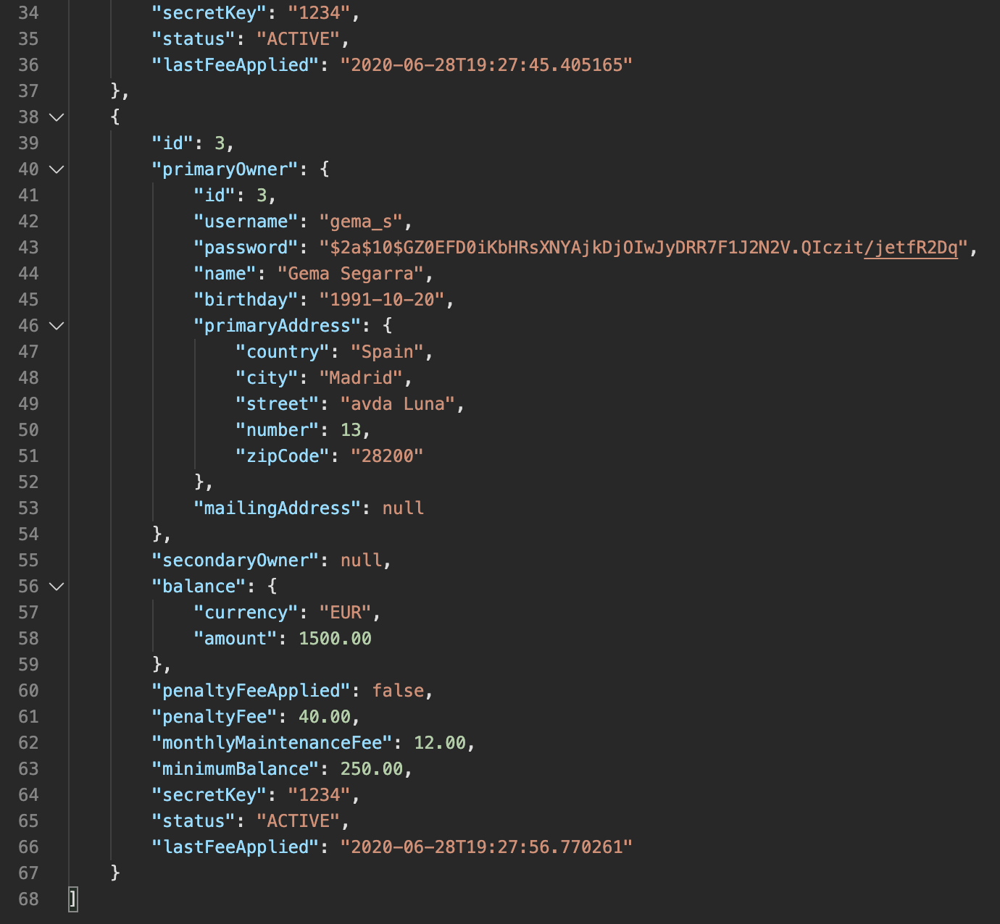

# Banking System

> REST API that simulates a banking system

REST API that recreates some of the functionalities of a banking system. This API allows to create clients (account holders) as well as third party users, several types of account and transfer money between accounts among other possibilities.

## Setup

To run this project locally do the following after cloning the project:

1. Create two databases: `banking_sys` and `banking_sys_test`
2. Insert own credentials in the application.properties files, both in /main folder and /test folder
3. Run `mvn spring-boot:run` to launch the application

To start with some seed data, a `seeds.sql` file is provided. It seeds the database with an admin, a third party user and three account holders, one being younger than 24 years. Once the program is running and database named `banking_sys` exists, seed it doing one of the following options:

- Open the file and execute it from MySQL Workbench
- Run the command `mysql -u <username> -p -n banking_sys < seeds.sql` , which will prompt for user's password

## API documentation

Every route is protected to admins, account holders and third party users according to its functionality. Authorization is achieved through Basic Auth which requires password and username.

### Admin routes

| Method | Endpoint              | Response                                                 |
| ------ | --------------------- | -------------------------------------------------------- |
| GET    | /api/v1/users         | retrieved data with all account holders                  |
| GET    | /api/v1/_accountType_ | retrieved data with all accounts of chosen _accountType_ |
| GET    | /api/v1/accounts/{id} | retrieved data from a specific account                   |
| POST   | /api/v1/users         | newly created account holder                             |
| POST   | /api/v1/third-parties | newly created third party user                           |
| POST   | /api/v1/accounts      | newly created account                                    |

There are some additional endpoints with no response:

- POST request to /api/v1/accounts/{id} to debit or credit an account
- PATCH reequest to /api/v1/accounts/{id}/status to update account's status

### Third party user routes

- POST request to /api/v1/third-parties/accounts/{id} to debit or credit an account. Secret key of said account is required

### Account holder routes

| Method | Endpoint                   | Response                                       |
| ------ | -------------------------- | ---------------------------------------------- |
| GET    | /api/v1/users/accounts     | retrieved data with all accounts owned by user |
| GET    | /api/v1/users/accounts{id} | retrieved data from a specific owned account   |

Logged account holders can transfer money from any of their accounts to another account through a POST request to /api/v1/transactions

Full API documentation can be found at [https://documenter.getpostman.com/view/10354400/T17AkBfm?version=latest](https://documenter.getpostman.com/view/10354400/T17AkBfm?version=latest). Additionally, `Banking_System.json` file can be imported into Postman to test the API.

## Technologies

[Spring](https://spring.io/)

[MySQL](https://www.mysql.com/)

## Overview

This is the first of two projects to be made during the Ironhack Java Bootcamp in Junee of 2020.

## Author

<table>
<tr><td align="center"><a href="https://github.com/anaSegarra"> <b>Ana Segarra</b></a> 
</table>
